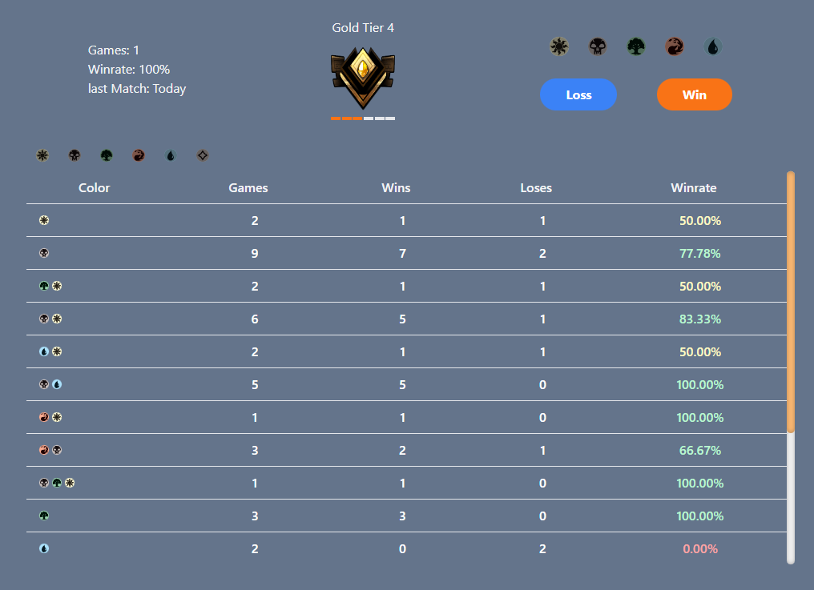
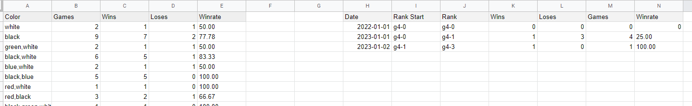

# Magic The Gathering Arena progress tracker
A project to keep track of how much progess was made in MTG: Arena.
Progress is tracked inside google sheets.





# Getting started

## Requirements
1. google project with access to google sheets api
2. service account credentials file
3. `.env` file containing configuration

```
SHEET_ID=<ID of google sheets table>
SHEET_NAME=<Sheet name>
GOOGLE_APPLICATION_CREDENTIALS=<Path to service account credentials file, e.g. ./secrets.json>
```
### Development
 - `npm run dev`

Commits require linting guidelines. Run linting with `npm run lint`, apply linting with `npm run format`.

### Production
 - `npm run build`
 - `node ./build`

# Todo:
- [ ] rank history table
- [ ] Link to google sheets table
- [ ] Rank down always happen if a loss occurs
- [ ] tests
